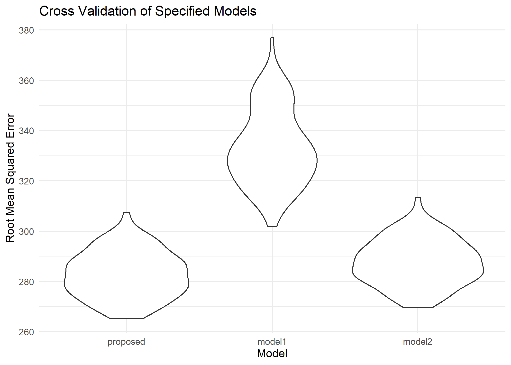

p8105\_hw6\_wz2590
================
Weiheng Zhang
2021/11/24

``` r
library(tidyverse)
library(dplyr)
library(patchwork)
library(modelr)

theme_set(theme_minimal() + theme(legend.position = "bottom"))

options(
  ggplot2.continuous.colour = "viridis",
  ggplot2.continuous.fill = "viridis"
)

scale_colour_discrete = scale_color_viridis_d
scale_fill_discrete = scale_fill_viridis_d
```

## Problem 1

Load and clean the data for regression analysis (i.e. convert numeric to
factor where appropriate, check for missing data, etc.).

``` r
birthweight_clean = 
  readr::read_csv("data/birthweight.csv") %>%
  mutate(
    babysex = factor(babysex, labels = c("Male", "Female")),
    frace = factor(frace, levels = c(1, 2, 3, 4, 8, 9), labels = c("White", "Black", "Asian"," Puerto Rican", "Other", "Unknown")),
    malform = factor(malform, labels = c("Absent", "Present")),
    mrace = factor(mrace,  c(1, 2, 3, 4, 8, 9), labels = c("White", "Black", "Asian"," Puerto Rican", "Other", "Unknown"))
    ) %>% 
  janitor::clean_names()
```

    ## Rows: 4342 Columns: 20

    ## -- Column specification --------------------------------------------------------
    ## Delimiter: ","
    ## dbl (20): babysex, bhead, blength, bwt, delwt, fincome, frace, gaweeks, malf...

    ## 
    ## i Use `spec()` to retrieve the full column specification for this data.
    ## i Specify the column types or set `show_col_types = FALSE` to quiet this message.

    ## Warning in FUN(X[[i]], ...): strings not representable in native encoding will
    ## be translated to UTF-8

    ## Warning in FUN(X[[i]], ...): unable to translate '<U+00C4>' to native encoding

    ## Warning in FUN(X[[i]], ...): unable to translate '<U+00D6>' to native encoding

    ## Warning in FUN(X[[i]], ...): unable to translate '<U+00E4>' to native encoding

    ## Warning in FUN(X[[i]], ...): unable to translate '<U+00F6>' to native encoding

    ## Warning in FUN(X[[i]], ...): unable to translate '<U+00DF>' to native encoding

    ## Warning in FUN(X[[i]], ...): unable to translate '<U+00C6>' to native encoding

    ## Warning in FUN(X[[i]], ...): unable to translate '<U+00E6>' to native encoding

    ## Warning in FUN(X[[i]], ...): unable to translate '<U+00D8>' to native encoding

    ## Warning in FUN(X[[i]], ...): unable to translate '<U+00F8>' to native encoding

    ## Warning in FUN(X[[i]], ...): unable to translate '<U+00C5>' to native encoding

    ## Warning in FUN(X[[i]], ...): unable to translate '<U+00E5>' to native encoding

``` r
birthweight_clean
```

    ## # A tibble: 4,342 x 20
    ##    babysex bhead blength   bwt delwt fincome frace gaweeks malform menarche
    ##    <fct>   <dbl>   <dbl> <dbl> <dbl>   <dbl> <fct>   <dbl> <fct>      <dbl>
    ##  1 Female     34      51  3629   177      35 White    39.9 Absent        13
    ##  2 Male       34      48  3062   156      65 Black    25.9 Absent        14
    ##  3 Female     36      50  3345   148      85 White    39.9 Absent        12
    ##  4 Male       34      52  3062   157      55 White    40   Absent        14
    ##  5 Female     34      52  3374   156       5 White    41.6 Absent        13
    ##  6 Male       33      52  3374   129      55 White    40.7 Absent        12
    ##  7 Female     33      46  2523   126      96 Black    40.3 Absent        14
    ##  8 Female     33      49  2778   140       5 White    37.4 Absent        12
    ##  9 Male       36      52  3515   146      85 White    40.3 Absent        11
    ## 10 Male       33      50  3459   169      75 Black    40.7 Absent        12
    ## # ... with 4,332 more rows, and 10 more variables: mheight <dbl>, momage <dbl>,
    ## #   mrace <fct>, parity <dbl>, pnumlbw <dbl>, pnumsga <dbl>, ppbmi <dbl>,
    ## #   ppwt <dbl>, smoken <dbl>, wtgain <dbl>

``` r
birthweight_clean %>% 
  select(everything()) %>% 
  summarize_all(funs(sum(is.na(.))))
```

    ## Warning: `funs()` was deprecated in dplyr 0.8.0.
    ## Please use a list of either functions or lambdas: 
    ## 
    ##   # Simple named list: 
    ##   list(mean = mean, median = median)
    ## 
    ##   # Auto named with `tibble::lst()`: 
    ##   tibble::lst(mean, median)
    ## 
    ##   # Using lambdas
    ##   list(~ mean(., trim = .2), ~ median(., na.rm = TRUE))
    ## This warning is displayed once every 8 hours.
    ## Call `lifecycle::last_warnings()` to see where this warning was generated.

    ## # A tibble: 1 x 20
    ##   babysex bhead blength   bwt delwt fincome frace gaweeks malform menarche
    ##     <int> <int>   <int> <int> <int>   <int> <int>   <int>   <int>    <int>
    ## 1       0     0       0     0     0       0     0       0       0        0
    ## # ... with 10 more variables: mheight <int>, momage <int>, mrace <int>,
    ## #   parity <int>, pnumlbw <int>, pnumsga <int>, ppbmi <int>, ppwt <int>,
    ## #   smoken <int>, wtgain <int>

There is no NA in this dataset. We can move on to the next step.

After some literature search, I will use scatter plots to browse some
potential variables that may be correlated to the birth weight.

``` r
birthweight_clean %>% 
  ggplot(aes(x = bhead, y = bwt)) + geom_point()
```

<!-- -->

``` r
birthweight_clean %>% 
  ggplot(aes(x = blength, y = bwt)) + geom_point()
```

<!-- -->

``` r
birthweight_clean %>% 
  ggplot(aes(x = gaweeks, y = bwt)) + geom_point()
```

<!-- -->

``` r
birthweight_clean %>% 
  ggplot(aes(x = delwt, y = bwt)) + geom_point()
```

<!-- -->

``` r
birthweight_clean %>% 
  ggplot(aes(x = fincome, y = bwt)) + geom_point()
```

<!-- -->

``` r
birthweight_clean %>% 
  ggplot(aes(x = smoken, y = bwt)) + geom_point()
```

<!-- -->

According to the trends shown in the scatter plots, I will choose. I
will choose the variables “baby’s head circumference at birth”, “baby’s
length at birth”, “gestational age in weeks”, and “mother’s weight at
delivery”.

``` r
proposed =
  lm(bwt ~ bhead + blength + gaweeks + delwt, data = birthweight_clean) 
broom::tidy(proposed) %>% 
    knitr::kable()
```

| term        |     estimate |  std.error |  statistic | p.value |
|:------------|-------------:|-----------:|-----------:|--------:|
| (Intercept) | -6249.526492 | 95.3679459 | -65.530682 |       0 |
| bhead       |   135.815296 |  3.5021062 |  38.781033 |       0 |
| blength     |    79.145148 |  2.0739313 |  38.161895 |       0 |
| gaweeks     |    14.181183 |  1.4916192 |   9.507241 |       0 |
| delwt       |     2.040243 |  0.1994743 |  10.228100 |       0 |

Now I will build a plot of model residuals against fitted values.

``` r
birthweight_clean %>%
  add_residuals(proposed) %>%
  add_predictions(proposed) %>%
  ggplot(aes(x = pred, y = resid)) + 
  geom_point()  + 
  labs(title = "Plot of Model Residuals Against Fitted Values", 
       x = "Fitted", 
       y = "Residuals")
```

<!-- -->

Other two models to compare with. Model 1: Using length at birth and
gestational age as predictors (main effects only) Model 2: sing head
circumference, length, sex, and all interactions (including the
three-way interaction) between these

``` r
model1 = lm(bwt ~ blength + gaweeks, data = birthweight_clean)

model2 = lm(bwt ~bhead*blength + bhead*babysex + blength*babysex + bhead*blength*babysex , data = birthweight_clean)

broom::tidy(model1) %>% 
    knitr::kable()
```

| term        |    estimate | std.error | statistic | p.value |
|:------------|------------:|----------:|----------:|--------:|
| (Intercept) | -4347.66707 | 97.958360 | -44.38281 |       0 |
| blength     |   128.55569 |  1.989891 |  64.60439 |       0 |
| gaweeks     |    27.04673 |  1.717930 |  15.74379 |       0 |

``` r
broom::tidy(model2) %>% 
    knitr::kable()
```

| term                        |      estimate |    std.error |  statistic |   p.value |
|:----------------------------|--------------:|-------------:|-----------:|----------:|
| (Intercept)                 | -7176.8170221 | 1264.8397394 | -5.6740920 | 0.0000000 |
| bhead                       |   181.7956350 |   38.0542051 |  4.7772811 | 0.0000018 |
| blength                     |   102.1269235 |   26.2118095 |  3.8962180 | 0.0000992 |
| babysexFemale               |  6374.8683508 | 1677.7669213 |  3.7996150 | 0.0001469 |
| bhead:blength               |    -0.5536096 |    0.7802092 | -0.7095656 | 0.4780117 |
| bhead:babysexFemale         |  -198.3931810 |   51.0916850 | -3.8830816 | 0.0001047 |
| blength:babysexFemale       |  -123.7728875 |   35.1185360 | -3.5244319 | 0.0004288 |
| bhead:blength:babysexFemale |     3.8780531 |    1.0566296 |  3.6702106 | 0.0002453 |

``` r
birthweight_clean %>%
  add_residuals(model1) %>%
  add_predictions(model1) %>%
  ggplot(aes(x = pred, y = resid)) + 
  geom_point()  + 
  labs(title = "Model1: Residuals Against Fitted Values", 
       x = "Fitted", 
       y = "Residuals")
```

<!-- -->

``` r
birthweight_clean %>%
  add_residuals(model2) %>%
  add_predictions(model2) %>%
  ggplot(aes(x = pred, y = resid)) + 
  geom_point()  + 
  labs(title = "Model2: Residuals Against Fitted Values", 
       x = "Fitted", 
       y = "Residuals")
```

<!-- -->

Perform cross validation.

``` r
birthweight_CV =
  crossv_mc(birthweight_clean, 100) %>% 
  mutate(train = map(train, as_tibble),
    test = map(test, as_tibble)) %>% 
  mutate(proposed = map(train, ~proposed, data = .x),
           model1 = map(train, ~model1, data = .x),
           model2 = map(train, ~model2, data = .x)) %>% 
    mutate(rmse_proposed = map2_dbl(proposed, test, ~rmse(model = .x, data = .y)),
           rmse_model1 = map2_dbl(model1, test, ~rmse(model = .x, data =.y)),
           rmse_model2 = map2_dbl(model2, test, ~rmse(model = .x, data = .y)))
```

``` r
birthweight_CV %>% 
  select(starts_with("rmse")) %>% 
  pivot_longer(
    everything(),
    names_to = "model", 
    values_to = "rmse",
    names_prefix = "rmse_") %>% 
  mutate(model = fct_inorder(model)) %>% 
  ggplot(aes(x = model, y = rmse)) + 
  geom_violin() +
  labs(
      title = "Cross Validation of Specified Models",
      x = "Model",
      y = "Root Mean Squared Error")
```

<!-- -->

After cross-validation, I find out that my proposed model, which is the
model that used “baby’s head circumference at birth”, “baby’s length at
birth”, “gestational age in weeks” and “mother’s weight at delivery”,
has the smallest RMSE and thus has the best fitting.
